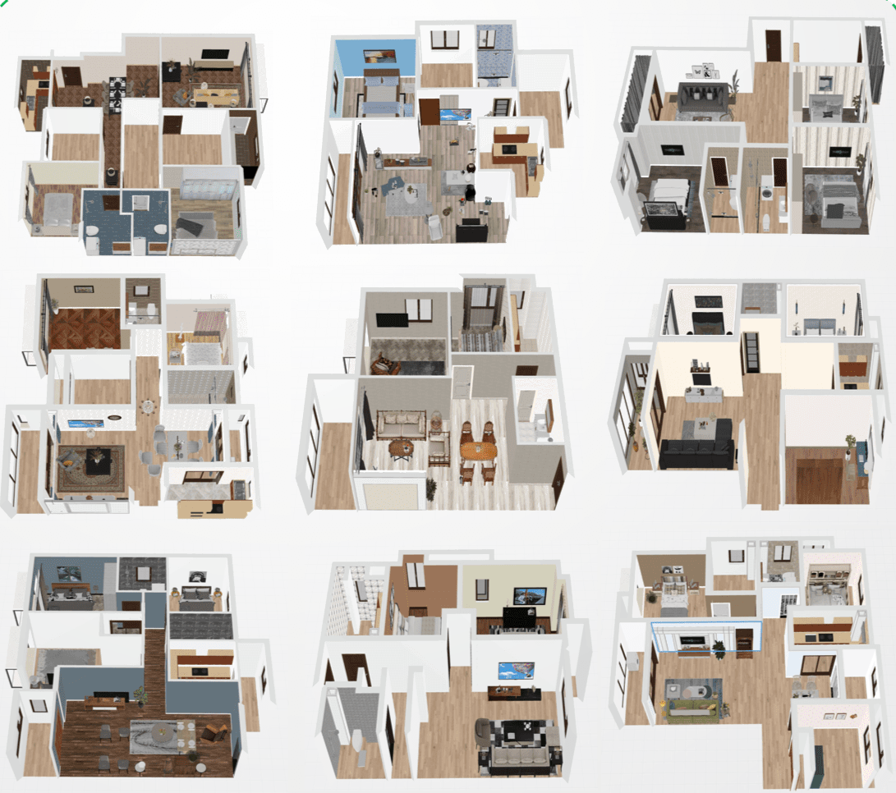
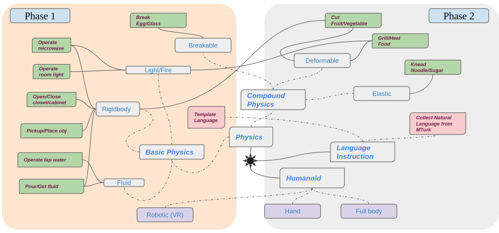
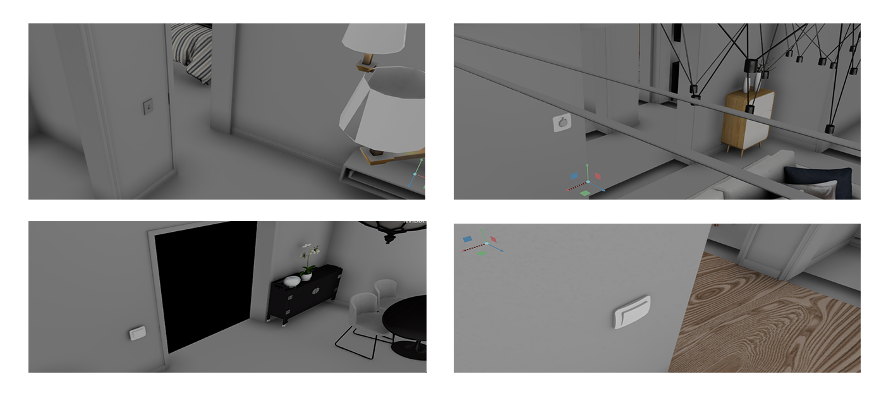
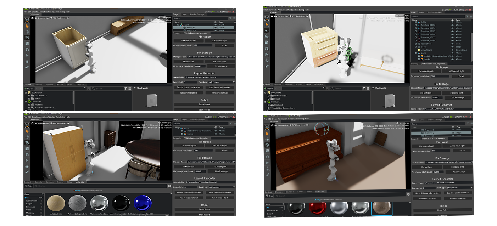
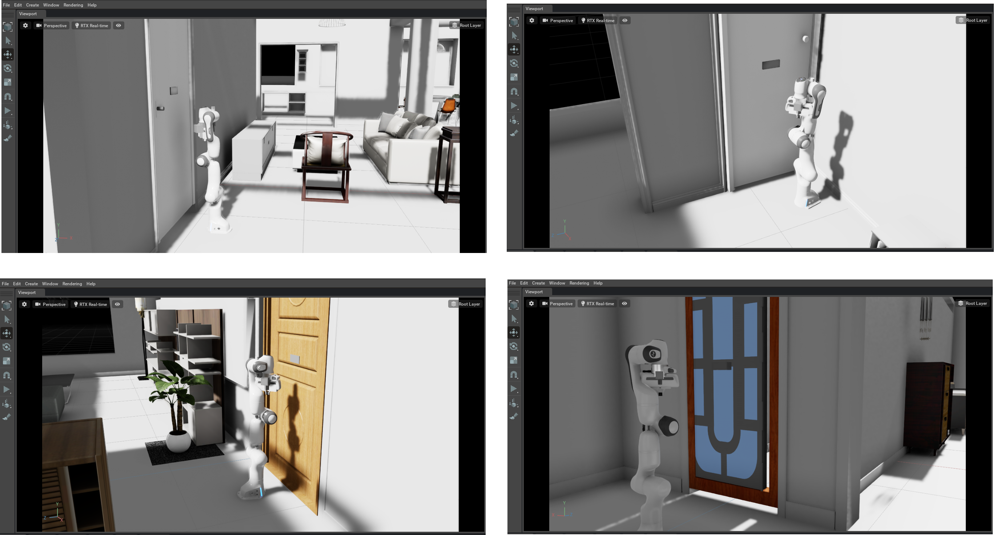
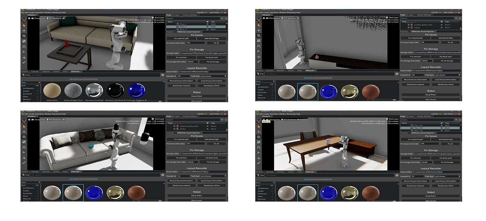
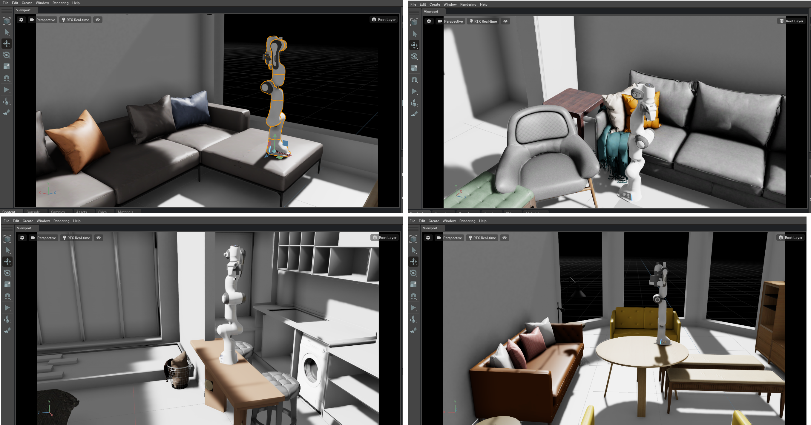

# VRKitchen2.0 [Full code coming soon 2/21/2022]

VRKitchen2.0 represents the new generation of Embodied AI platform that supports realistic physical interaction in photo-realistic scenes. 

## Nvidia Omniverse Backend

VRKitchen2.0 is based on Nvidia Omniverse, a new Nvidia infasructure that enables photorealistic rendering based on RayTracing, USD format support across all applications, state-of-the-art commercial physics engines, full python support, and full robotics planning interfaces and sensors with GPU accelerations.

## High Fidelity Physics

VRKitchen2.0 goes beyond abstract grasping and discrete states, and includes rich & continuous fluent changes for physical states. Realistic and meaningful tasks are also included to better leverage the physical system.

 
## Realistic Household Tasks

VRkitchen2.0 includes a comprehensive collection of realistic household tasks. These include picking up objects, open/close doors, cooking, transfering water, etc. 

## Comparing State-of-the-arts

| Name                          | Physics Fidelity  | Scenes Quality        |   Task            |   Accessibility   | 
| ----------                    | -----------       |   --------            |   --------        |   --------        |
|   AI2Thor (2017 Alen AI)      |   Low             |   Low                 |   Unrealistic     |   Open Source     |
|   VirtualHome (2018 MIT)      |   None            |   Low                 |   Realistic       |   Open Source     |
|   Sapien (2020 UCSD)          |   Low             |   None                |   Limited         |   Limited         |
|   3DWorld (2021 IBM-MIT)      |   Low             |   Photo-realistic     |   None            |   Low             |
|   iGibison2.0 (2021 Stanford) |   Low             |   Photo-realistic     |   Realistic       |   Low             |
|   Habitat2.0  (2021 Facebook) |   Low             |   Photo-realistic     |   Limited         |   Low             |
|   **VRK2.0 (2022 UCLA)**      |   **High**        |   **Photo-realistic** |   **Realistic**   |   **Open Source** |

## Task Samples

### Turn on the light

### Open the drawer/closet

### Open the door

### Pickup the bottle

### Reorient stuff

